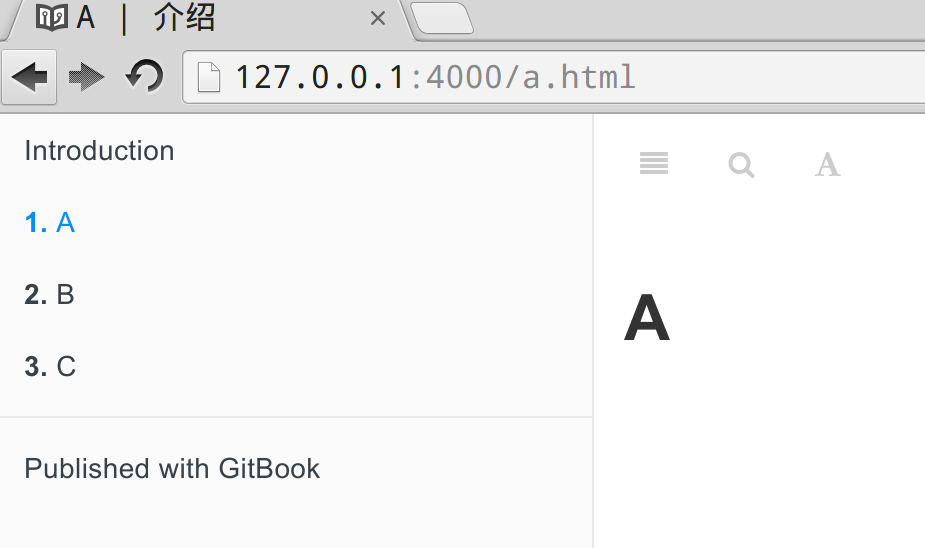
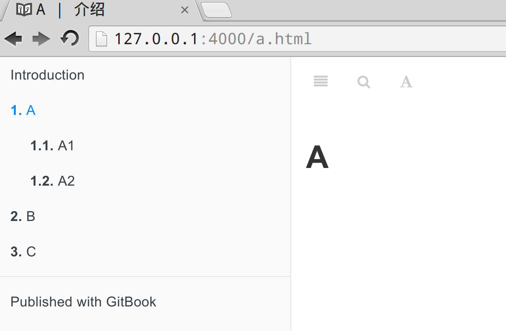
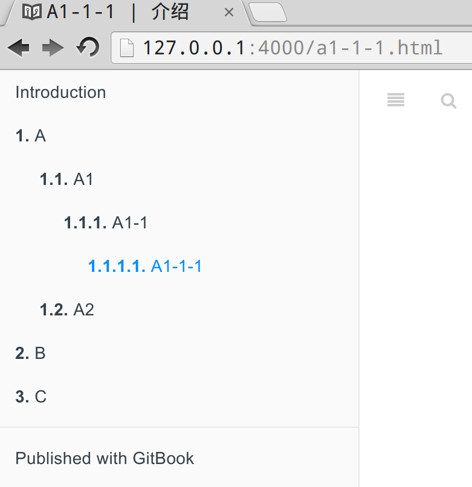

# 添加章节

## 加入新章节

在testbook下新建3个文件，然后修改 SUMMARY.md，内容如下：

    # Summary

    * [A](a.md)
    * [B](b.md)
    * [C](c.md)

此时看到的内容如下：

左侧导航栏中会列出当前所有的章节，方便跳转。

下面红框中的这个按钮可以关闭/打开左侧的导航栏：

## 导航栏层次

gitbook默认支持导航栏的层次结构：

    # Summary

    * [A](a.md)
        * [A1](a1.md)
        * [A2](a2.md)
    * [B](b.md)
    * [C](c.md)

子章节只需要缩进一个 TAB 就可以了。

效果如下：

## 多级导航栏

老版本的gitbook默认只支持两层的导航栏，在遇到内容比较多而需要章节层次比较深时，很不方便。

好在后来新版本的gitbook终于提供了多级导航栏的支持，方式和前面一致，继续 TAB 缩进就是：

    # Summary

    * [A](a.md)
        * [A1](a1.md)
            * [A1-1](a1-1.md)
                * [A1-1-1](a1-1-1.md)
        * [A2](a2.md)
    * [B](b.md)
    * [C](c.md)

多级导航栏的效果如下：

> 注： 之前的gitbook版本为了支持 多级导航栏，需要将第一行从 “# Summary” 修改为 “bui# Summary”，最新的版本不需要了

## 使用目录管理

当章节较多时，如果都放在根目录下，难于查找和管理。

gitbook支持目录，可以将不同内容放在不同的目录下，然后修改 SUMMARY.md ，将路径加入即可。

下面例子中将所有的 `*.md` 文件分别存放在 a/b/c 三个子目录中：

    # Summary

    * [A](a/a.md)
        * [A1](a/a1.md)
            * [A1-1](a/a1-1.md)
                * [A1-1-1](a/a1-1-1.md)
        * [A2](a/a2.md)
    * [B](b/b.md)
    * [C](c/c.md)

注意：每个文件的目录都必须完整，多层结构中路径是不会自动继承上级目录的路径的。

## 导航栏占位符

某些情况下，当章节内容还没有开始编写，也不想放置一个空文件时，可以使用类似占位符的方式先占据导航栏的位置。

此时只需要将文件路径设置为空即可，如下面的D：

    # Summary

    * [A](a/a.md)
        * [A1](a/a1.md)
            * [A1-1](a/a1-1.md)
                * [A1-1-1](a/a1-1-1.md)
        * [A2](a/a2.md)
    * [B](b/b.md)
    * [D]()